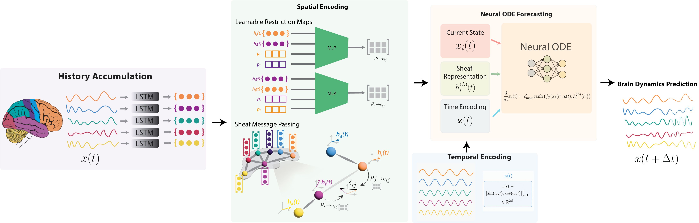

# BrainDyn

**BrainDyn** is a dynamic sheaf-based graph ordinary differential equation (ODE) network which mediates the propagation of information across regions through learned time-varying linear transformations and uses these propagated embeddings to drive the time-evolution of neural activity.

---



---

## Overview

The core model (`BrainDyn`) operates in four stages:

1. **History Accumulation**: To encode the recent temporal history of each node, we use an LSTM trained on observations in the context window.
2. **Sheaf message passing via learnable and time-varying restriction maps**: To model the structured and heterogeneous communication between brain regions, we employ learnable, edge-specific, time-varying restriction maps which align the node representations produced by the LSTM.
3. **Time and position embeddings**: We model both node identities using position embeddings as well as temporal information via a learned sinusoidal position embedding. 
4. **Forecasting via neural ODE**: To forecast future neural activity, we train a graph neural ODE, based on the output of the sheaf message passing and the learned time encoding.

### Datasets

| Dataset | Description |
|---------|-------------|
| **PNC fMRI** | Philadelphia Neurodevelopmental Cohort resting-state fMRI; short (32 timepoint context → 8 timepoint forecast) and long forecast variants |
| **LEMON EEG** | MPI Leipzig Mind-Brain-Body database; 62-channel scalp EEG at 250 Hz, preprocessed to per-subject `.npy` blocks; also short and long forecast |
| **NEST (simulated)** | Synthetic multi-neuron spiking dataset from `.npz`; used for forecasting responses to unseen perturbations |

---

## Installation

Requires Python ≥ 3.11.

**Recommended (uv):**
```bash
uv venv
source .venv/bin/activate
uv sync
```

**Alternative (pip):**
```bash
python -m venv .venv
source .venv/bin/activate
pip install -e .
```

---

## Data

The raw source data (PNC imaging, raw LEMON EEG) lives on the shared HPC store. Full dataset documentation — manifest schemas, preprocessing pipelines, sample formats — lives in **[`data/README.md`](data/README.md)**.

| Dataset | Path | Contents |
|---------|------|----------|
| **PNC fMRI** | `data/manifest.csv` (passed via `--manifest_csv`, filtered with `--cohort PNC`; the scripts default to `data/manifest_fmri.csv`, overridable via `MANIFEST_CSV`) | RBC manifest indexing Schaefer-400 / CPAC-parcellated resting-state timeseries. |
| **LEMON EEG** | `data/lemon_manifest.csv` (not tracked; build it locally) | Manifest over per-subject, boundary-free `.npy` EEG blocks (58–61 ch, eyes-closed), built by `data/lemon_build_npy.py` + `data/lemon_make_manifest.py`. Passed via `--lemon_manifest_csv`. |
| **NEST (simulated)** | `nest_simulated_neurons_silencedc/dataset.npz` | Synthetic multi-neuron spiking dataset. Generated with `scripts/generate_nest_dataset.sh` (wraps `data/simulate_neuron_dataset.py`) using `--perturbation-mode silence_dc` (see below); provenance and seed formulas are recorded in the sibling `run_config.json`. |

---

## Experiments

All experiments are launched via Slurm scripts in `scripts/`. Run from the repo root:

### PNC fMRI — short horizon
```bash
sbatch scripts/timeenc_fmri_short_spatial.sh   # spatial graph (main results)
sbatch scripts/timeenc_fmri_short.sh           # Granger graph (graph comparison)
```

### PNC fMRI — long horizon (autoregressive)
```bash
sbatch scripts/timeenc_fmri_long_ar_spatial.sh # spatial graph (main results)
sbatch scripts/timeenc_fmri_long_ar.sh         # Granger graph (graph comparison)
```

### PNC fMRI — ablations
```bash
sbatch scripts/timeenc_fmri_short_ablations.sh
sbatch scripts/timeenc_fmri_long_ar_ablations.sh
```

### LEMON EEG — short horizon
```bash
sbatch scripts/timeenc_eeg_short_spatial.sh    # spatial graph (main results)
sbatch scripts/timeenc_eeg_short.sh            # Granger graph (graph comparison)
```

### LEMON EEG — long horizon (autoregressive)
```bash
sbatch scripts/timeenc_eeg_long_ar_spatial.sh  # spatial graph (main results)
sbatch scripts/timeenc_eeg_long_ar.sh          # Granger graph (graph comparison)
```

### LEMON EEG — ablations
```bash
sbatch scripts/timeenc_eeg_short_ablations.sh
sbatch scripts/timeenc_eeg_long_ar_ablations.sh
```

### Functional-connectivity graph (graph comparison, fMRI + EEG)
```bash
sbatch scripts/timeenc_fc_all.sh
```

### NEST simulated neuron dataset
Data generation and training are Slurm jobs:
```bash
OUT_DIR=nest_simulated_neurons_silencedc EXTRA_ARGS="--perturbation-mode silence_dc" \
  sbatch scripts/generate_nest_dataset.sh
HORIZON=short  sbatch --array=0-19 --time=00:40:00 scripts/nest_f01_train.sh
HORIZON=arlong sbatch --array=0-19 scripts/nest_f01_train.sh
```

---

## Analysis

Restriction-map geometry (Frobenius norm, effective rank, SVD/polar decomposition, orthogonality defect, diffusion directedness, edge contributions, ...) is analyzed with [`analysis/restriction_maps.py`](analysis/restriction_maps.py):

| Notebook | Purpose |
|----------|---------|
| [`notebooks/restriction_map_mlp_analysis.ipynb`](notebooks/restriction_map_mlp_analysis.ipynb) | Main analysis notebook for the MLP parametrized restriction maps |
| [`notebooks/restriction_maps_paper_figures.ipynb`](notebooks/restriction_maps_paper_figures.ipynb) | Paper figure generation |

Typical flow: `build_model_from_ckpt` to rebuild a model from a checkpoint, `harvest_maps` / `harvest_over_loader` to collect the `(P, H, d_e)` map population from data, then the geometry functions (`svd_polar`, `effective_rank`, `orthogonality_defect`, `sheaf_edge_contributions`, ...) directly on the result.

---

## Model configuration

`BrainDynConfig` ([`model/braindyn.py`](model/braindyn.py)) controls model architecture. Every field is set from a `main.py` CLI flag unless noted; run `python main.py --help` for full flag documentation. The experiment scripts override several of these defaults (see `scripts/_timeenc_base.sh`).

The model integrates a **non-autonomous augmented neural ODE** ([`model/time_encoding_ode.py`](model/time_encoding_ode.py)): a vector field including a sinusoidal embedding of `t`.

### Core architecture

| Flag | Default | Description |
|------|---------|-------------|
| `--hidden_dim` | `16` | LSTM / sheaf hidden size |
| `--x` (→ `window_size`) | `30` | Context window length (time steps) |
| `--lstm_layers` | `1` | Number of LSTM layers |
| `--lstm_dropout` | `0.0` | LSTM dropout |
| `--map_hidden_dim` | `16` | Sheaf restriction-map bottleneck dimension |
| `--vf_hidden_dim` | `128` | Vector field MLP hidden size |
| `--vf_layers` | `2` | Linear layers in the ODE vector-field MLP (Tanh between each pair); `2` = the original Linear-Tanh-Linear |

`signal_dim` is fixed at 1 and `num_nodes` is inferred from the dataset — neither is a CLI flag.

### Sheaf graph diffusion

| Flag | Default | Description |
|------|---------|-------------|
| `--sheaf_layers` | `1` | Rounds of `(I - step·L_F)` sheaf diffusion |
| `--diffusion_step` | `1.0` | Step size in the diffusion update |
| `--sheaf_norm` | `sym` | Degree normalization of `L_F`: `none`, `sym`, `row` |
| `--sheaf_map_pe` | `learned` | Positional encoding fed into the restriction-map MLP: `none`, `lappe`, `learned` |
| `--sheaf_map_pe_dim` | `8` | PE width |
| `--sheaf_map_scale` | `norm` | Reparametrize maps as `exp(s)·direction(M)`: `none`, `norm`, `orth` |
| `--freeze_map_scale` / `--no-freeze_map_scale` | `True` | Pin the learned scale `s`; requires `--sheaf_map_scale != none` |
| `--identity_restriction_init` / `--no-identity_restriction_init` | `True` | Initialize restriction maps at identity instead of Xavier random |
| `--static_edge_maps` | `False` | One learned static map per edge instead of the shared data-dependent MLP |
| `--map_mlp_hidden_dim` | `64` | Hidden width of the restriction-map MLP |
| `--learn_diffusion_gain` | `False` | Learn a scalar multiplier on `--diffusion_step` instead of fixing it |
| `--no_sheaf` | `False` | Ablation: freeze restriction maps at identity, collapsing to the plain graph Laplacian |

### Time-encoding ODE

| Flag | Default | Description |
|------|---------|-------------|
| `--time_embed_dim` | `16` | Width of the fixed sinusoidal time embedding (half sin, half cos). `0` is the no-time-encoding ablation: the field drops `t` and the ODE reverts to autonomous |
| `--time_embed_max_period` | `16.0` | Longest wavelength in the fixed frequency schedule, in solver-time units (forecast steps) — not Hz, and not modality-dependent |
| `--time_rate_mode` | `fixed` | Learn the output amplitude R in `dx_i/dt = R·tanh(MLP(...))`: `fixed` (R = `2.0`), `global` (one learned scalar), `per_node` (one learned value per region) |
| `--time_learn_freqs` | `False` | Learn the sinusoid frequencies (initialized at the fixed geometric schedule), capped at `--time_max_cycles_per_step` |
| `--time_max_cycles_per_step` | `0.5` | Nyquist cap on learned frequencies, in cycles per forecast step; only used with `--time_learn_freqs` |

---

## Project structure

```
BrainDyn/
├── main.py                        # fMRI + LEMON EEG training entrypoint (--dataset fmri|lemon_eeg)
├── model/
│   ├── braindyn.py                # Top-level model (ODE integrator, BrainDynConfig)
│   ├── dynamics.py                # dx/dt vector field (BrainDynDynamics)
│   ├── sheaf.py                   # Sheaf Laplacian & optional GCN aggregator
│   ├── time_encoding_ode.py       # Sinusoidal time-encoding neural ODE
│   ├── temporal_encoder.py        # LSTM history encoder
│   ├── graph_builders.py          # Graph priors (spatial, Granger, FC, SC)
│   └── losses.py                  # MSE, MAE, DTW losses
├── data/
│   ├── rbc_dataset.py             # PNC/HBN fMRI manifest + dataset
│   ├── lemon_dataset.py           # LEMON EEG manifest + dataset
│   ├── sn_dataset.py              # NEST simulated-neuron dataset
│   ├── simulate_neuron_dataset.py # NEST dataset generator (scripts/generate_nest_dataset.sh)
│   ├── lemon_build_npy.py / lemon_make_manifest.py  # LEMON preprocessing
│   └── atlases/                   # Schaefer-400 centroids (created by scripts/build_schaefer_centroids.py)
├── train/
│   ├── train_nest_braindyn.py     # NEST training entrypoint (scripts/nest_f01_train.sh)
│   └── train_nest.py              # Older standalone NEST trainer (not used by the scripts)
├── analysis/
│   └── restriction_maps.py        # Restriction-map geometry analysis library
├── notebooks/                     # Analysis notebooks
├── scripts/                       # Slurm job submission scripts (timeenc_*.sh and nest_f01_train.sh are the experiment runs)
└── logs/slurm/                    # Slurm stdout/stderr logs
```
